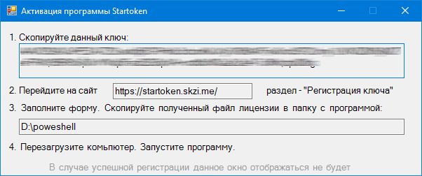

.. _startoken.skzi.me: https://startoken.skzi.me

**Введение**
===============================================

Возможности продукта
--------
Startoken - программа оптимизирует работу компаний, занимающихся выдачей ЭП (удостоверяющие центры (УЦ), сервисные центры УЦ, и.т.д)
Функционал программы реализует автоматическое определение подключенного к компьютеру токена.

Руководители компаний, сотрудники службы безопасности и администраторы сетей, использующие Startoken, могут отслеживать практически все подключенные к ПК носители на компьютерах предприятия, как в реальном времени, так и в ретроспективе.С помощью данной программы Вы сможете реально оценить эффективность работы Ваших сотрудников. Также это отличный инструмент для расследования различных инцидентов, связанных с работой со съемными носителями.
* Автоматическое отображение серийного номера устройства при подключении
* Поддержка основных производителей токенов
* Гибкая настройка уведомлений (исключение отдельных носителей, например, носителя инженера)
* Определение модели устройства
* Ведение локального журнала подключенных устройств

Архитектура
--------
Startoken является клиентским приложением, не требующим наличие сервера. Устанавливается на машину под управлением ОС Windwos 7/10 и использует для хранения данных простые текстовые файлы.

Доступ к данным и управление мониторингом осуществляется через интерфейс программы,работы с которым не требует специальных навыков. 
Агент представляет собой процесс, запущенный на рабочей станции. Он собирает и обрабатывает информацию о подключенных носителях на компьютере. Данные накапливаются в локальной базе.

Установка Агента для ОС семейства Windows производится локально или удаленно через групповые политики (GPO) Active Directory. Для установки требуются права локального (доменного) администратора.

Покупка продукта
--------
.. important:: Будьте внимательны при указании инн и email, программа будет привязана на основании данных реквизитов.

#. Выбрать подходящую лиценpию на странице (startoken.skzi.me_), в разделе :guilabel:`&Цены`
#. Нажать кнопку :guilabel:`&Приобрести`
#. Опеределить способ оплаты, "Выставить счет" либо "Оплатить онлайн"
#. После успешной оплаты, на указанный Email адрес придет письмо с файлом программы

Регистрация продукта
--------
При первом запуске агента, программа сгенерирует уникальный ключ для регистрации. Данный ключ позволяет однозначно идентифицировать комьпютер. 

   
#. Необходимо скопировать данный ключ и перейти на сайт (startoken.skzi.me_), в раздел :guilabel:`&Регистрация ключа`
#. Указать ИНН компании, что **указывали при оплате** и email адрес на который необходимо выслать файл лицензии. 
#. В случае успешной регистрации вашей копии программы, в течении нескольких минут на указанную вами почту придет письмо с файлом лицензии. 
#. Данный файл необходимо скачать и скопировать в папу с программой. 
#. Перезагрузите компьютер. 
#. Запустите программу. 

В случае успешной регистрации, данное окно появлятся не будет. В трее вы увидите иконку программы |иконка|
